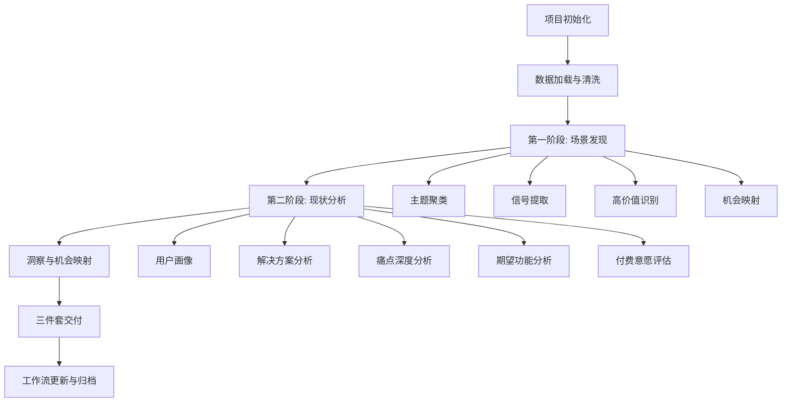

# AI产品需求调研方法论 v2

## 最终目的（以文件形式牢记）

> **以真实数据支撑的手机用户诉求和手机高价值新特性方向洞察。**
>
> 所有工作流的终点，是产出可指导手机产品决策的、有数据支撑的洞察报告。

---

## 核心架构

### 一、项目隔离机制

每个调研主题对应一个独立项目目录：

```
workspace/
└── ai-demand-research-v2/
    ├── SKILL.md                          # 本文件
    ├── references/                        # 参考资料
    ├── templates/                         # 报告模板
    ├── scripts/                           # 可复用脚本
    ├── assets/                            # 静态资源
    └── projects/                          # 各调研项目
        └── {topic-name}-{YYYY-MM-DD}/     # 单个项目目录
            ├── 00-meta/                   # 项目元数据
            │   ├── project.json           # 项目配置
            │   └── workflow.html          # 工作流可视化
            ├── 01-raw-data/               # 原始数据
            ├── 02-cleaned/                # 清洗后数据
            ├── 03-phase1-discovery/       # 第一阶段：场景发现
            ├── 04-phase2-analysis/        # 第二阶段：现状分析
            ├── 05-insights/               # 洞察与机会
            ├── 06-reports/                # 最终交付件
            └── archive/                   # 归档历史版本
```

**项目创建规则：**
- 用户明确说"开启新项目" → 创建新项目
- 当前主题与已有项目明显不同 → 询问是否创建新项目
- 同一主题的回滚/重新生成 → 在现有项目内操作，旧文件移入 `archive/`

### 二、中间过程可控（Provenance）

每一步分析必须保存三类文件：

```
{step-name}/
├── input/                 # 输入数据（符号链接或副本）
│   └── {source-files}
├── code/                  # 处理代码
│   └── {step-name}.py
├── output/                # 输出结果
│   └── {result-files}
└── manifest.json          # 步骤清单
```

**manifest.json 规范：**
```json
{
  "step_id": "phase1-step3-signal-extract",
  "step_name": "需求信号提取",
  "version": 1,
  "timestamp": "2026-05-14T16:30:00+08:00",
  "input": {
    "files": ["../02-cleaned/output/cleaned_data.parquet"],
    "checksum": "sha256:abc123..."
  },
  "code": {
    "file": "code/signal_extract.py",
    "checksum": "sha256:def456..."
  },
  "output": {
    "files": ["output/signal_stats.json", "output/signal_details.csv"],
    "checksums": {"signal_stats.json": "sha256:ghi789..."}
  },
  "parameters": {
    "signal_threshold": 0.7,
    "min_interaction": 100
  },
  "notes": "使用v1.2信号词典，新增'后悔'信号"
}
```

**回滚机制：**
- 重新生成时，旧文件移入 `archive/v{N}-{timestamp}/`
- 保留完整历史，支持随时回溯到任意版本

### 三、工作流可视化

每个项目包含一个自动更新的 `00-meta/workflow.html`：

- **节点状态**：待执行 / 执行中 / 已完成 / 已归档
- **点击节点**：展开该步骤的输入、代码、输出清单
- **实时更新**：每完成一步自动刷新
- **差异高亮**：回滚后重新生成的步骤用特殊颜色标记

### 四、三件套交付件

| 交付件 | 文件名 | 内容 | 风格 |
|--------|--------|------|------|
| 最终分析报告 | `06-reports/final-analysis-report.html` | 洞察、机会、建议 | 酷炫交互式 |
| 过程技术报告 | `06-reports/technical-report.html` | 每一步的方法、代码、参数 | 技术文档风 |
| 任务改进建议 | `06-reports/improvement-report.html` | 方法论改进、工具优化、流程建议 | 结构化清单 |

**内容原则：宜多不宜少，交互性强，风格要酷。**

---

## 工作流总览



---

## 第一阶段：场景发现

### Step 1: 数据加载与清洗

**输入**：原始数据文件（Excel/JSONL/SQLite）
**输出**：清洗后的标准化数据

**关键检查点：**
1. 确认数据源格式
2. 检查互动量字段类型
3. 查看搜索词分布
4. 处理缺失值和异常值

**代码模板**：见 `templates/data_loader.py`

### Step 2: 主题聚类分析

**输入**：清洗后的数据
**输出**：主题分布统计、主题-内容映射

**主题词典**（根据业务场景调整）：
```python
topics = {
    '备孕怀孕': ['备孕', '怀孕', '产检', '孕吐', '胎动', '预产期', '待产包', '顺产', '剖腹产'],
    '喂养辅食': ['喂奶', '母乳', '奶粉', '辅食', '挑食', '过敏', '营养', '奶量'],
    '睡眠作息': ['睡觉', '夜醒', '哄睡', '入睡', '睡眠', '作息', '夜奶', '自主入睡'],
    '健康疾病': ['发烧', '感冒', '咳嗽', '湿疹', '过敏', '疫苗', '生病', '医院', '医生'],
    '发育成长': ['发育', '生长', '身高', '体重', '大运动', '语言', '认知', '早教'],
    '情绪心理': ['焦虑', '抑郁', '情绪', '脾气', '哭闹', '安全感', '分离焦虑'],
    '教育引导': ['教育', '早教', '启蒙', '绘本', '玩具', '专注力', '规则', '管教'],
    '日常护理': ['洗澡', '穿衣', '换尿布', '护肤', '防晒', '刷牙', '护理'],
    '母婴用品': ['纸尿裤', '奶瓶', '推车', '安全座椅', '衣服', '玩具', '用品'],
    '妈妈恢复': ['产后', '恢复', '减肥', '妊娠纹', '盆底肌', '腹直肌', '月子']
}
```

### Step 3: 需求信号提取

**信号词典：**
```python
signals = {
    '痛点信号': ['难', '痛苦', '崩溃', '焦虑', '担心', '害怕', '慌', '烦', '累', '困', '无助', '绝望', '后悔', '自责', '内疚'],
    '决策信号': ['怎么选', '哪个好', '推荐', '对比', '测评', '攻略', '清单', '必买', '种草'],
    '求助信号': ['怎么办', '正常吗', '求助', '请教', '有经验', '过来人', '建议'],
    '行为信号': ['每天', '经常', '总是', '习惯', '规律', '记录', '打卡', '坚持']
}
```

### Step 4: 内容质量评估

**UGC vs 营销识别：**
```python
marketing_signals = ['好物', '推荐', '测评', '必买', '清单', '品牌', '链接', '优惠', '团购', '种草', '带货']
ugc_signals = ['求助', '怎么办', '正常吗', '崩溃', '焦虑', '后悔', '吐槽', '日记', '记录', '日常', '我的', '我家']

def classify_content(text):
    has_marketing = any(s in text for s in marketing_signals)
    has_ugc = any(s in text for s in ugc_signals)
    if has_marketing and not has_ugc: return '纯营销'
    elif has_ugc and not has_marketing: return '纯UGC'
    elif has_marketing and has_ugc: return '混合'
    else: return '中性'
```

### Step 5: 高价值内容识别

**筛选标准：**
- 互动量 > 5000（或前20%）
- 包含痛点信号或期望信号
- 优先纯UGC内容

### Step 6: 产品机会映射

**机会评估矩阵：**

| 维度 | 权重 | 评估标准 |
|------|------|---------|
| 需求强度 | 30% | 痛点覆盖率、互动量 |
| 供给缺口 | 25% | 现有工具满意度、信息分散度 |
| 技术可行性 | 20% | AI/数据/硬件可实现性 |
| 商业价值 | 15% | 付费意愿、用户生命周期 |
| 竞争壁垒 | 10% | 数据壁垒、专家资源 |

### Step 7: 搜索词优化建议

**基于分析结果优化下一轮搜索：**
- 高覆盖但低互动 → 需求已被满足，减少搜索
- 低覆盖但高互动 → 供给缺口，增加搜索
- 高痛点但低期望 → 需求未被识别，需教育市场

---

## 第二阶段：现状分析

### 分析框架

#### 1. 用户画像提取

```python
# 宝宝月龄/阶段
age_patterns = [
    r'(\d+)\s*个月', r'(\d+)\s*月龄', r'(\d+)\s*岁',
    r'新生儿', r'小月龄', r'二月闹', r'幼儿园'
]

# 家长身份
identity_patterns = [
    r'新手妈妈', r'新手爸妈', r'职场妈妈', r'全职妈妈',
    r'奶爸', r'宝爸', r'90后', r'00后'
]
```

#### 2. 当前解决方案分析

**提取维度：**
- 使用什么APP/工具/平台
- 使用频率和场景
- 满意度（从文本情绪推断）

#### 3. 痛点深度分析

```python
pain_categories = {
    '操作繁琐': ['麻烦', '复杂', '繁琐', '费劲', '累', '没时间'],
    '信息过载': ['信息', '太多', '杂乱', '分散', '不知道看哪个'],
    '知识焦虑': ['焦虑', '担心', '害怕', '慌', '不确定', '不知道'],
    '选择困难': ['纠结', '选哪个', '怎么选', '对比', '哪个好'],
    '质量参差': ['不靠谱', '不科学', '错误', '误区', '坑'],
    '缺乏系统': ['零散', '碎片化', '不系统', '不成体系'],
    '实操困难': ['理论', '实操', '实践', '落地', '执行', '坚持']
}
```

#### 4. 期望功能分析

```python
expectation_types = {
    '即时问答': ['问答', '问', '回答', '解答', '咨询', '问医生'],
    '知识库': ['知识库', '百科', '大全', '指南', '手册', '宝典'],
    '个性化推荐': ['推荐', '个性化', '定制', '针对', '适合'],
    '视频学习': ['视频', '课程', '教程', '直播', '讲解'],
    '社区交流': ['交流', '分享', '讨论', '群', '社区'],
    '专家服务': ['专家', '医生', '咨询', '问诊', '指导'],
    'AI辅助': ['AI', '智能', '自动', '一键', '语音', '拍照'],
    '系统学习': ['系统', '体系', '完整', '全面', '进阶']
}
```

#### 5. 付费意愿与隐私顾虑

```python
payment_signals = {
    '愿意付费': ['愿意', '值得', '花钱买', '付费', '充值', '会员', '订阅'],
    '看广告': ['广告', '看视频', '免费', '薅羊毛'],
    '价格敏感': ['贵', '便宜', '性价比', '省钱', '优惠', '折扣'],
    '需要试用': ['试用', '体验', '先试试', '七天无理由']
}

privacy_signals = ['隐私', '本地', '不上传', '不泄露', '安全', '放心', '加密', '云端']
```

---

## 通用技术实现

### 数据读取

```python
import pandas as pd
import json
from collections import Counter
import re

# Excel格式
df = pd.read_excel('data.xlsx')

# JSONL格式
contents = []
with open('data.jsonl', 'r', encoding='utf-8') as f:
    for line in f:
        if line.strip():
            contents.append(json.loads(line))

# SQLite格式
import sqlite3
conn = sqlite3.connect('database.db')
df = pd.read_sql_query("SELECT * FROM xhs_note;", conn)
```

### 互动量计算

```python
def parse_count(value):
    """处理特殊格式如'10万+'、'1.2万'、'1,234'"""
    if not value:
        return 0
    if isinstance(value, (int, float)):
        return int(value)
    value = str(value).strip().replace(',', '')
    if '万' in value:
        try:
            return int(float(value.replace('万+', '').replace('万', '')) * 10000)
        except:
            return 0
    if '+' in value:
        value = value.replace('+', '')
    try:
        return int(value)
    except:
        return 0

df['liked_count_num'] = df['liked_count'].apply(parse_count)
df['total_interaction'] = df['liked_count_num'] + df['collected_count_num'] + df['comment_count_num'] + df['share_count_num']
```

---

## 关键原则

1. **不预设需求** — 用场景+情绪词搜索，而非功能名
2. **多维度交叉** — 主题+痛点+期望+行为，四维度验证
3. **关注异常信号** — 低覆盖+高互动 = 供给缺口
4. **UGC优先** — 纯UGC内容可信度高于营销内容
5. **从情绪到功能** — 痛点词→行为词→期望词→功能机会
6. **迭代优化** — 每轮分析后优化搜索词，持续深入
7. **过程可追溯** — 每一步的输入、代码、输出都必须保存
8. **项目隔离** — 不同主题严格隔离，避免数据污染

---

## 参考文件

- `references/sqlite-data-source.md` — SQLite数据源处理指南
- `references/project-structure.md` — 项目目录结构详解
- `references/workflow-html-spec.md` — 工作流HTML规范
- `references/report-templates.md` — 三件套报告模板规范
- `templates/data_loader.py` — 数据加载代码模板
- `templates/analysis_pipeline.py` — 分析流水线代码模板
- `templates/workflow.html` — 工作流可视化HTML模板
- `scripts/init_project.py` — 项目初始化脚本
- `scripts/archive_version.py` — 版本归档脚本
