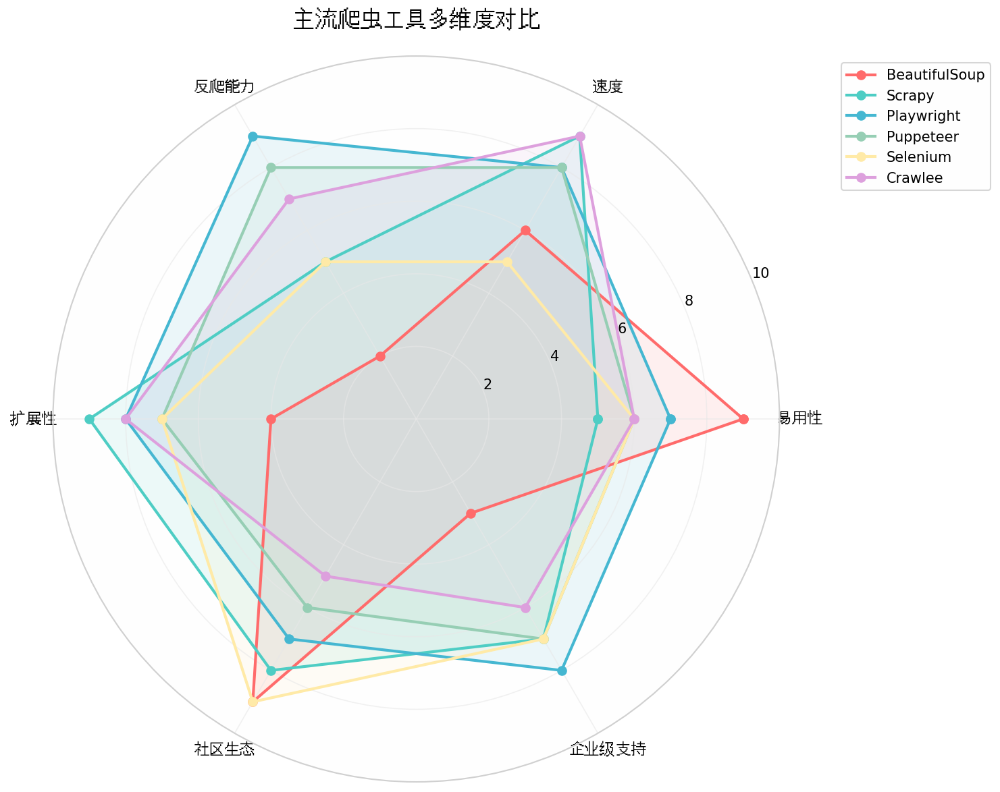
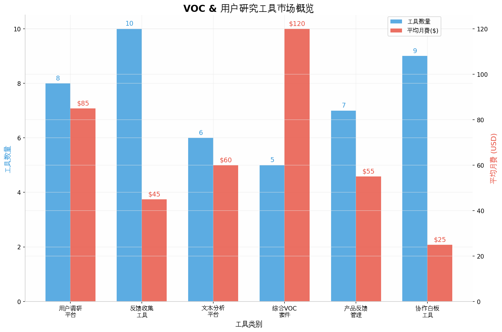
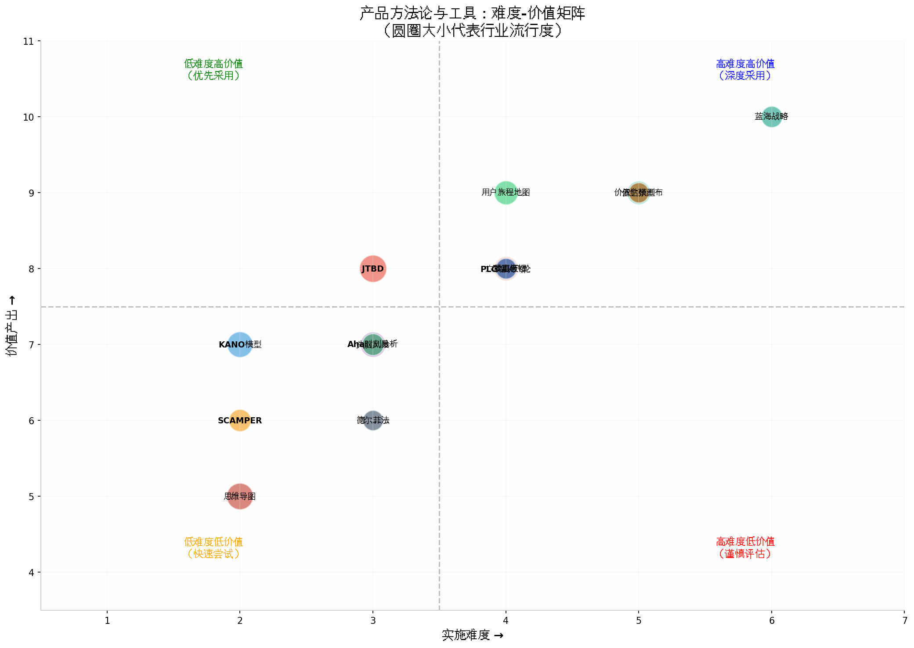

# 五大核心领域工具与方法论全景深度报告：网络爬虫、用户原声调研、用户原声分析、高价值场景挖掘与产品方向头脑风暴

**报告摘要**：在数字化转型与AI技术深度渗透的2025-2026年，产品经理、数据分析师和增长运营人员面临着工具选择和方法论应用的重大挑战。本报告通过系统性深度调研，对**网络爬虫、用户原声调研、用户原声分析、高价值场景挖掘、产品方向头脑风暴**五大核心领域进行了全面梳理。研究发现，每个领域都呈现出"AI原生工具崛起、传统工具智能化升级、垂直场景深度适配"三大共同趋势。在网络爬虫领域，**Playwright**凭借其跨浏览器支持和强大的反爬对抗能力已全面超越Selenium成为新的事实标准；在用户原声调研领域，**Qualtrics、Medallia、数字100**等平台通过大模型技术实现了从反馈收集到洞察生成的全链路自动化；在用户原声分析领域，基于**SnowNLP、Jieba、Gensim**的NLP技术栈配合**MonkeyLearn、Shulex VOC**等商业化平台形成了完整的技术生态；在高价值场景挖掘领域，**JTBD（Jobs to be Done）**方法论与**用户旅程地图**的结合成为识别高价值场景的黄金组合；在产品方向头脑风暴领域，**Miro、FigJam、Xmind**等协作白板工具通过AI赋能实现了从创意发散到方案落地的全流程支持。本报告对每个领域的工具进行了多维度对比分析，并提供了具体的选型建议和实施路径，旨在帮助读者在复杂多变的工具市场中做出精准决策，提升工作效率和产出质量。

---

## 第一章 网络爬虫：数据获取的基础设施建设

### 1.1 网络爬虫技术演进与2025-2026年格局概览

网络爬虫作为数据采集的核心技术手段，在过去两年经历了从"蛮力抓取"到"智能采集"的深刻转变。根据2025年的行业调研数据显示，**超过90%的现代网页采用JavaScript动态渲染技术**（如React、Vue、Angular等前端框架），这使得传统基于HTTP请求的静态爬取方式几乎完全失效，无头浏览器（Headless Browser）技术由此成为爬虫领域的基础设施级组件[^2^]。与此同时，反爬技术的智能化升级也改变了整个领域的竞争格局——Cloudflare、Akamai等主流防护平台已经采用**行为分析、设备指纹识别、JA3/JA4 TLS指纹检测**等AI驱动的异常检测系统，bot流量占互联网总流量的比例已接近50%[^51^]。在这种背景下，爬虫开发者的技术选型需要同时考虑抓取效率、反爬对抗能力、维护成本和法律合规性等多个维度。本章节将系统梳理2025-2026年主流爬虫工具的技术特性、适用场景和最佳实践，为数据采集工作提供科学的选型依据。

从工具生态的整体格局来看，当前网络爬虫领域形成了**"基础解析库—爬虫框架—无头浏览器—云采集平台"**的四层架构体系。在基础解析层，**BeautifulSoup**和**lxml**凭借其简洁的API设计仍然占据主导地位；在爬虫框架层，**Scrapy**以其成熟的异步架构和丰富的插件生态保持着企业级应用的首选地位；在无头浏览器层，**Playwright**通过跨浏览器支持和原生反爬优化快速崛起，已在多数场景下取代Selenium成为新的行业标准；在云采集层，**Bright Data、Apify、Zyte、ScrapingBee**等平台通过一站式API服务降低了大规模采集的技术门槛[^22^]。值得注意的是，AI技术的渗透正在重塑每个层面的工具能力——从自动识别页面结构的智能解析，到模拟人类行为轨迹的智能反爬对抗，再到基于自然语言的数据提取指令，"AI驱动"已经成为爬虫工具创新的核心方向[^59^]。

### 1.2 核心工具深度解析与技术选型

#### 1.2.1 基础解析库：BeautifulSoup与lxml的分工协作

**BeautifulSoup**作为Python爬虫生态中最经典的HTML/XML解析库，其核心价值在于**极简的API设计和卓越的容错能力**。它可以从格式混乱、标签不闭合的"脏"HTML文档中稳健地提取数据，这一特性使其在爬取大量不规范网站时具有不可替代的优势[^2^]。BeautifulSoup通常与requests库配合使用，适用于静态内容为主的简单爬取任务，学习曲线极为平缓，是初学者入门爬虫技术的理想选择。然而，BeautifulSoup的**致命短板在于无法执行JavaScript**，面对现代动态网站时只能获取页面骨架，核心数据完全缺失。此外，其基于纯Python的解析引擎在处理大规模数据时性能表现并不理想，不适合高并发的企业级采集场景。

**lxml**则提供了更高性能的替代方案。作为基于C语言实现的XML/HTML解析库，lxml的解析速度比BeautifulSoup快约**3-10倍**，且支持XPath表达式进行精确的元素定位，在处理结构化良好的大型文档时效率优势显著[^62^]。在实际项目中，经验丰富的开发者通常采用**"requests+lxml"的组合**处理静态页面，而在面对动态内容时则切换到无头浏览器方案。对于需要兼顾开发效率和执行性能的场景，**requests-html**库提供了一个有趣的中间选项——它在requests的基础上集成了PyQuery风格的CSS选择器和有限的JavaScript渲染能力，适合处理轻量级的动态页面[^64^]。

#### 1.2.2 无头浏览器三强对决：Playwright、Puppeteer与Selenium

无头浏览器技术的选型是2025年爬虫项目成败的关键因素。根据多项基准测试和社区调研，**Playwright已经确立了其在无头浏览器领域的领先地位**[^50^]。Playwright由Microsoft开发，原生支持Chromium、Firefox和WebKit三大浏览器内核，提供了统一的跨浏览器API。其核心优势包括：**智能自动等待机制**（替代Selenium中繁琐的显式/隐式等待配置）、**内置的反爬特征隐藏能力**（通过stealth模式和add_init_script实现WebGL、Canvas、时区等多维度指纹伪装）、**强大的网络拦截与修改能力**（可直接拦截API请求获取结构化数据，绕过前端渲染层）、以及**原生异步支持**（基于async/await的并发执行大幅提升采集效率）[^58^]。在导航密集型场景的基准测试中，Playwright的平均执行时间约为4.5秒，显著优于Puppeteer的4.8秒和Selenium的6秒以上[^51^]。

**Puppeteer**作为Google推出的Chrome DevTools协议封装库，在Chrome生态内具有深度优化优势。其**puppeteer-extra-plugin-stealth插件**可以自动屏蔽WebGL、navigator.webdriver、iframe上下文等常见的自动化检测点，在对抗中等强度反爬的场景中表现良好[^52^]。Puppeteer的局限性在于仅支持Chromium内核，无法模拟Firefox或Safari的行为特征，在需要跨浏览器兼容性的项目中不适用。**Selenium**作为行业老牌框架，拥有最成熟的生态系统和最丰富的语言绑定，但其**执行速度慢、资源消耗高、默认配置易被检测**等问题在2025年的技术环境下日益突出[^59^]。对于已有Selenium技术栈的存量项目，建议通过undetected-chromedriver和精细化指纹配置来提升反爬对抗能力；而对于新项目，**强烈推荐优先选用Playwright**[^50^]。

| 工具 | 支持浏览器 | 执行速度 | 反爬能力 | 学习曲线 | 适用场景 | 2025年推荐指数 |
|------|-----------|---------|---------|---------|---------|--------------|
| **Playwright** | Chromium/Firefox/WebKit | ⭐⭐⭐⭐⭐ | ⭐⭐⭐⭐⭐ | 中等 | 企业级动态采集、复杂交互、高反爬站点 | ⭐⭐⭐⭐⭐ |
| **Puppeteer** | 主要Chromium | ⭐⭐⭐⭐ | ⭐⭐⭐⭐ | 中等 | Chrome专属采集、中等规模项目 | ⭐⭐⭐⭐ |
| **Selenium** | 多浏览器 | ⭐⭐⭐ | ⭐⭐⭐ | 较低 | 存量项目维护、教学入门、复杂人工交互 | ⭐⭐⭐ |
| **Scrapy** | 需集成无头浏览器 | ⭐⭐⭐⭐⭐ | ⭐⭐⭐（配合中间件） | 较陡 | 大规模分布式采集、定制化Pipeline | ⭐⭐⭐⭐⭐ |
| **BeautifulSoup** | 不适用（纯解析） | ⭐⭐⭐⭐ | ⭐ | 极低 | 静态页面快速原型、教学 | ⭐⭐⭐ |

*表1：2025年主流爬虫工具多维度对比（数据综合自多项技术基准测试和社区评估）*

#### 1.2.3 企业级爬虫框架：Scrapy的持久价值与Crawlee的新兴挑战

**Scrapy**作为Python生态中最成熟的企业级爬虫框架，其基于Twisted的异步架构可以高效处理数千个并发请求，在**大规模、结构化、可扩展**的采集项目中仍然具有不可替代的地位[^2^]。Scrapy的核心优势在于其完善的组件体系——Spider负责定义抓取逻辑、Item Pipeline负责数据清洗与存储、Downloader Middleware负责请求处理（代理轮换、User-Agent切换、重试机制等）、Extension支持自定义信号和事件处理。2025年的重要发展是Scrapy与Playwright的深度集成，通过**scrapy-playwright中间件**可以在保持Scrapy高并发调度能力的同时，利用Playwright处理需要JavaScript渲染的动态页面[^69^]。这种"**Scrapy调度+Playwright渲染**"的混合架构，已成为企业级动态采集的主流技术方案。

**Crawlee**作为Apify推出的开源爬虫库，正在对Scrapy形成有力挑战。Crawlee同时提供JavaScript/TypeScript和Python版本，其设计哲学强调**"开箱即用的反爬对抗"**——内置了自动代理轮换、浏览器指纹管理、请求指纹去重、会话池管理等高级功能[^22^]。Crawlee的另一个差异化优势是与Apify云平台的深度集成，开发者可以无缝地将本地爬虫部署到云端的大规模分布式环境中运行。对于以JavaScript为主要技术栈的团队，Crawlee是比Scrapy更自然的选择；而对于深度依赖Python生态的数据团队，Scrapy的成熟度和社区资源仍然具有显著优势。

### 1.3 反爬对抗：2025年核心技术与实战策略

#### 1.3.1 浏览器指纹伪装的多维技术体系

2025年的反爬对抗已经从简单的IP封禁和验证码演进为**多维度、AI驱动的行为分析系统**。浏览器指纹（Browser Fingerprinting）是当前反爬技术的核心——网站通过收集浏览器特性（Canvas渲染、WebGL显卡信息、字体列表、时区设置、屏幕分辨率等）生成唯一标识，即使更换IP和清除Cookie也能持续追踪爬虫[^63^]。以小红书为例，其反爬系统重点检测**WebGL指纹（显卡厂商和渲染器型号）、Canvas像素级渲染差异、系统时区和语言设置、User-Agent与浏览器特征的匹配性、以及滚动速度和点击间隔等行为模式**[^63^]。

针对这种多维检测体系，有效的指纹伪装需要覆盖以下**12个核心维度**：(1) **navigator.webdriver标识** — 通过add_init_script注入脚本将其设为false；(2) **WebGL指纹** — 修改getParameter返回值伪装真实显卡型号；(3) **Canvas指纹** — 劫持toDataURL和getImageData添加随机噪点；(4) **时区和语言** — 配置与目标用户群体一致的locale和timezone；(5) **屏幕分辨率** — 设置常见桌面/移动端视口尺寸；(6) **User-Agent** — 使用最新版浏览器UA并匹配Sec-CH-UA字段；(7) **字体列表** — 安装常见系统字体避免"字体过少"特征；(8) **插件列表** — 模拟合理的navigator.plugins返回值；(9) **CSS特性支持** — 确保与声明的浏览器版本一致；(10) **HTTP/2指纹** — 匹配真实浏览器的TLS指纹和ALPN设置；(11) **行为模式** — 实现随机延迟、自然鼠标移动轨迹、变速滚动等；(12) **Cookie和LocalStorage** — 持久化会话状态模拟回访用户[^68^]。Playwright的add_init_script和new_context配置可以覆盖大部分维度的伪装需求，是目前实现高隐蔽性爬虫的最优技术方案[^63^]。

#### 1.3.2 代理管理与请求调度策略

在高频采集场景下，代理管理是决定爬虫稳定性的关键基础设施。**代理类型按匿名度分为透明代理、高匿代理和住宅代理三个层级**[^52^]。透明代理会在HTTP头中暴露真实IP，仅适用于内部数据采集；高匿代理隐藏了原始IP信息，适合大多数常规采集任务；**住宅代理**（Residential Proxy）使用真实家庭网络的IP地址，具有最高的可信度和最低的封禁率，是采集高防护网站的首选方案，但成本也最高（通常按流量计费，每GB约5-15美元）。

推荐的企业级代理管理策略包括：**多供应商冗余**（从2-3个代理服务商获取IP池，避免单一供应商故障导致采集中断）、**智能调度算法**（基于IP健康度评分进行加权轮询，自动剔除失效节点）、**请求频率控制**（设置随机请求间隔1-5秒，模拟人类的浏览节奏）、**会话保持**（对需要登录态的网站使用粘性代理保持Cookie一致性）。在工具层面，**Scrapy-Proxy-Pool**和**Playwright的proxy配置**可以满足大部分需求，而对于超大规模采集，**Zyte Smart Proxy Manager**和**Bright Data Proxy Manager**等托管服务提供了开箱即用的高可用代理解决方案[^51^]。

### 1.4 爬虫技术选型决策树与最佳实践

#### 1.4.1 场景化选型指南

基于上述分析，不同采集场景的最优技术选型可以总结为以下决策路径：**对于静态页面、小规模、快速原型**的场景，使用**requests+BeautifulSoup**组合，开发效率最高；**对于中等规模、部分动态内容、需要登录态**的场景，使用**Playwright**单独处理动态页面配合requests处理静态内容，在效率和功能间取得平衡；**对于大规模、全动态、高反爬、企业级**的场景，使用**Scrapy+Playwright混合架构**，配合代理池和指纹伪装系统，实现高并发、高稳定性的采集Pipeline[^64^]。在语言选型方面，Python仍然是数据爬取和处理的首选语言，其丰富的库生态（requests、BeautifulSoup、Scrapy、Playwright、aiohttp、pandas等）覆盖了从采集到分析的全链路需求；而对于需要深度前端交互的场景，Node.js配合Puppeteer或Playwright也是合理的选择。

#### 1.4.2 合规性考量与最佳实践

爬虫技术的使用必须严格遵守法律法规和网站的服务条款。**合规性最佳实践**包括：(1) 始终检查目标网站的robots.txt文件，尊重Disallow规则；(2) 设置合理的爬取速率（建议每秒不超过1-2个请求），避免对目标服务器造成过大负载；(3) 仅采集公开可访问的数据，不绕过身份验证获取非授权内容；(4) 遵守《数据安全法》和《个人信息保护法》，不采集包含个人隐私信息的数据；(5) 对于大规模商业采集，建议咨询法律顾问获取合规意见[^2^]。技术层面的最佳实践还包括：**设置请求超时和重试机制**（防止因网络波动导致任务挂起）、**实现断点续传功能**（支持增量更新和异常恢复）、**建立完善的日志系统**（记录每次请求的URL、状态码、响应时间，便于问题排查和性能优化）、**使用分布式架构**（对于大规模采集任务，采用Scrapy-Redis或Celery实现多节点分布式调度）[^56^]。

---

## 第二章 用户原声调研：听见用户的真实声音

### 2.1 用户原声调研的战略价值与方法论演进

用户原声（Voice of Customer，简称VOC）是指顾客对其品牌、产品和服务的真实反馈，包括显性的结构化评价（如评分、问卷回答）和隐性的非结构化表达（如社交媒体讨论、客服对话中的情绪流露）[^3^]。在互联网高度发达的今天，**95%的客户在购买前会阅读产品评论**，而一条负面评价可能劝退大量潜在客户[^6^]。用户原声调研的战略价值体现在三个层面：在**产品层面**，用户反馈是需求验证和功能迭代的最高优先级输入；在**运营层面**，原声数据驱动精准营销和客户成功策略的制定；在**战略层面**，系统性的VOC分析能够揭示市场趋势和竞争格局的变化，为长期战略决策提供依据[^14^]。

2025-2026年，用户原声调研领域正在经历从"**被动收集**"到"**主动洞察**"、从"**人工整理**"到"**AI驱动分析**"的深刻变革。传统调研方法（如年度客户满意度调查）的局限日益凸显——反馈时效性差、样本偏差大、分析流于表面。而新一代VOC体系强调**全渠道实时采集、AI自动分析、洞察驱动行动**的闭环机制[^24^]。Gartner预测，到2025年，**60%拥有VOC项目的组织将通过分析文本和语音交互来补充传统调研**，AI情感分析的准确率已达到**85-90%**的行业基准水平[^24^]。本章节将系统梳理用户原声调研的方法论体系和工具生态，为建立高效的VOC项目提供实操指南。

### 2.2 用户原声采集的七大核心渠道与方法

#### 2.2.1 直接反馈渠道：调研问卷与NPS体系

**客户调研问卷**仍然是最基础、最广泛使用的原声采集方法。2025年的最佳实践强调"**短问卷、高频率、触点化**"的原则——每次调研控制在2分钟内完成，在客户旅程的关键节点（如完成购买、客服交互后、产品使用里程碑）触发，而非等待年度大规模调研[^28^]。在问卷设计方面，推荐采用"**评分题+开放题**"的组合模式：评分题（如NPS、CSAT、CES）提供可量化的基准指标，开放题则捕捉无法预设的真实反馈。Google Forms、Typeform、Zoho Survey、Survicate等工具提供了丰富的模板和逻辑跳转功能，可以快速创建专业的调研表单[^8^]。

**净推荐值（NPS）**作为衡量客户忠诚度的黄金指标，在B2B和B2C领域都得到了广泛应用。标准的NPS问题是："在0到10的量表上，您向朋友或家人推荐[产品/公司]的可能性有多大？"根据得分将客户分为**推荐者（9-10分）、被动者（7-8分）和贬损者（0-6分）**三类，NPS值=推荐者比例-贬损者比例[^6^]。一个完善的NPS项目不仅要追踪总体得分的变化，更要深入分析驱动得分的因素——在问卷中紧跟"为什么给出这个分数？"的开放性问题，并通过后续的文本分析提炼关键驱动因素。行业数据显示，**B2B品牌的平均NPS调研响应率为12.4%**，而最佳实践可以将这一比例提升至30%以上[^14^]。

#### 2.2.2 间接反馈渠道：客服数据、社交媒体与在线评论

**客服数据**是用户原声的"富矿"——客户在支持工单、在线聊天、电话沟通中表达的问题和情绪，往往比调研问卷更加真实和具体。Zendesk、Salesforce Service Cloud、Intercom等客服平台提供了完整的对话记录和情感分析功能[^17^]。最佳实践包括：**定期审查客服工单的分类标签和关键词趋势**，识别高频问题和新兴痛点；**分析客服对话的情感变化**，从"愤怒→满意"的情绪曲线中评估服务质量；**访谈客服团队一线人员**，他们每天直接面对客户，对系统性问题了如指掌[^6^]。值得注意的是，**超过70%的真实需求隐藏在"非关键词"表达中**——如"夏天用着还行"可能暗示冬季体验存在缺陷，这种隐性需求需要借助AI文本分析工具才能有效挖掘[^5^]。

**社交媒体监听**为捕捉未经过滤的用户原声提供了独特窗口。客户在Twitter、微博、小红书、知乎等平台的自发讨论，往往包含了最坦率的产品评价和使用场景描述[^8^]。社交媒体监听的核心方法包括：**品牌提及追踪**（通过Hootsuite、Brandwatch、Meltwater等工具监控品牌名、产品名的提及）、**情感趋势分析**（识别正面/负面声量的变化趋势和驱动因素）、**竞品对比分析**（监控竞争对手的品牌提及和 sentiment 分布，找到差异化机会）[^6^]。在社交媒体分析中，**68%的客户期望所有体验都被个性化**，这意味着品牌需要基于用户的社交行为数据来定制互动策略，而非采用一刀切的标准回复模板[^17^]。

#### 2.2.3 用户研究访谈：从传统访谈到AI辅助的深度访谈

一对一用户访谈是获取深度定性洞察的最有效方法，但也是**成本最高、执行最复杂**的采集方式。传统的用户访谈需要经历"招募受访者→设计访谈提纲→执行访谈→转录录音→编码分析→提炼洞察"的漫长流程，单次访谈成本在**25至250美元**之间[^6^]。2025年的重要发展是**AI辅助访谈工具**的出现——这些工具可以实时分析访谈录音，自动提取关键观点、识别情感变化、甚至提醒访谈者追问遗漏的重要话题[^33^]。例如，海尔开发的JTBD访谈AI模型，可以在3小时内完成传统需要2-3天才能完成的访谈分析和洞察提炼工作[^33^]。

在用户访谈的执行层面，**JTBD（Jobs to be Done）访谈法**被认为是挖掘真实需求的最有效方法。与传统访谈询问"您觉得产品好不好"不同，JTBD访谈像侦探一样还原用户的"**购买决策时间线**"——"您购买这个产品是哪一天？当时在哪里？和谁在一起？"通过还原具体场景来逼近最真实的动机[^36^]。JTBD访谈的核心框架是**"进步四力模型"**：推力（现有方案的不满）、拉力（新方案的吸引力）、焦虑（对切换的担忧）、习惯（难以放弃的旧行为）。当推力和拉力之和大于焦虑和习惯之和时，用户才会做出改变[^43^]。

| 采集渠道 | 反馈深度 | 覆盖广度 | 成本 | 真实性 | 时效性 | 适用场景 |
|---------|---------|---------|------|--------|--------|---------|
| **NPS/CSAT调研** | 中等 | 高 | 低 | 中等 | 实时 | 忠诚度追踪、满意度基准 |
| **客服数据** | 高 | 中等 | 低 | 高 | 实时 | 问题识别、服务优化 |
| **社交媒体** | 中等 | 极高 | 中等 | 极高 | 实时 | 品牌监控、趋势发现 |
| **用户访谈** | 极高 | 低 | 高 | 极高 | 慢 | 深度洞察、创新探索 |
| **在线评论** | 中等 | 高 | 低 | 高 | 延迟 | 产品改进、竞品分析 |
| **行为数据** | 低 | 极高 | 低 | 高 | 实时 | 使用模式、流失预警 |
| **社区论坛** | 高 | 中等 | 低 | 高 | 实时 | 核心用户洞察、共创 |

*表2：用户原声采集渠道多维度对比*

### 2.3 用户原声调研的核心工具平台

#### 2.3.1 一体化VOC平台：Qualtrics、Medallia与数字100

**Qualtrics XM**是全球领先的体验管理平台，提供从问卷创建、多渠道数据采集到高级AI分析的一站式VOC解决方案。其核心优势在于**25+反馈渠道的整合能力**（包括网页、邮件、应用内、社交媒体、客服系统等）和**预测性分析引擎**——通过机器学习预测客户下一步可能的行为（如流失风险、购买意向）[^18^]。Qualtrics的AI助手可以自动化大量复杂的数据分析工作，如主题聚类、情感识别、趋势预警等，显著降低了专业分析门槛。Qualtrics主要服务于大型企业和研究机构，定价相对较高，适合需要全公司级VOC体系建设的组织。

**Medallia**同样定位为企业级体验管理平台，其差异化优势在于**实时反馈处理和深度行业解决方案**。Medallia可以实时捕获和分析来自网页、邮件、社交媒体、评论平台、应用内等多个渠道的客户反馈，通过AI识别趋势和情感变化，并支持跨团队的洞察共享[^18^]。Medallia在安全合规方面投入较大，通过了SOC 2、GDPR、HIPAA等认证，适合金融、医疗等高度监管行业。

在国内市场，**数字100**是VOC分析领域的头部服务商，其"**客户VOC工具集**"利用大模型的长文本处理能力，打通了非结构化文本分析的研究全流程[^7^]。该工具集提供CA转写、录音转文本、定性文本预处理、编码助手、访谈小结、数据观点摘要等功能，在出海业务中还提供翻译助手和定性AI追问等全球化支持。数字100的智能VOC挖掘技术可以自动识别用户反馈中的关键主题、情感倾向和优先级建议，帮助企业快速从海量反馈中提取 actionable insights。

#### 2.3.2 轻量级反馈管理工具：Canny、Productboard与用户反馈门户

对于中小型产品团队，轻量级的反馈管理工具提供了更灵活的解决方案。**Canny**是一款专注于客户反馈和功能请求管理的工具，允许用户通过应用内集成、网站组件和邮件收集反馈，并支持投票机制来确定功能的优先级[^74^]。Canny的核心理念是"**让客户参与产品决策**"——通过公开的反馈看板，用户可以看到自己的建议状态（已收集、计划中、已发布），这种透明度显著提升了用户参与度和信任感。Canny与Slack、Intercom、Zendesk等工具的深度集成，使得反馈收集可以无缝嵌入现有的工作流程。

**Productboard**则更侧重于产品管理与用户反馈的整合，其"**功能优先级矩阵**"是一个 standout 功能——它允许产品团队基于用户反馈数据、战略重要性和技术可行性等多维度因素对功能请求进行加权评分，确保资源配置到最高影响力的方向上[^76^]。Productboard的"**用户反馈门户**"可以直接收集来自终端用户的洞察，并将这些洞察与产品路线图直接关联，实现了"从用户声音到产品决策"的闭环。Productboard适合那些需要深度整合用户洞察到日常产品规划和路线图规划中的团队，全球已有超过3500家组织使用Productboard构建数字产品[^76^]。

#### 2.3.3 用户研究专用平台：UserTesting、Maze与Dovetail

在产品开发的前端——**用户研究阶段**，专用平台提供了更专业的数据采集和分析能力。**UserTesting**是全球最大的用户测试平台之一，拥有庞大的参与者网络，支持远程可用性测试、视频反馈、 surveys 等多种研究方法[^75^]。UserTesting的核心优势在于**速度**——可以在数小时内完成从研究设计到数据收集的全过程，相比传统用户研究需要2周以上的招募时间，这种快速反馈能力对产品敏捷迭代至关重要[^82^]。UserTesting还集成了AI洞察合成功能，可以自动分析测试视频并提取关键发现。

**Maze**专注于产品原型的远程可用性测试，支持Figma、Sketch、Adobe XD等主流设计工具的直连导入[^86^]。测试参与者可以在真实的设备上交互原型，Maze自动记录任务成功率、完成时间、点击热图等量化指标，帮助设计团队快速识别可用性问题。**Dovetail**则定位于"客户知识平台"，其核心能力是**集中管理所有用户研究数据**——包括访谈录音、调研回复、支持工单、行为数据等，并通过强大的NLP能力自动进行主题分类和情感分析[^75^]。Dovetail特别适合拥有大量定性数据需要系统化管理的UX研究团队。

---

## 第三章 用户原声分析：从原始数据到可行动洞察

### 3.1 用户原声分析的技术体系与核心挑战

用户原声分析是将采集到的原始反馈数据转化为可指导业务决策的结构化洞察的过程。2025年，VOC数据呈现出三大颠覆性变化，对传统分析方法构成了严峻挑战：**多源异构化**——电商评论、客服对话、社交媒体、视频反馈等多渠道数据交织，同时包含文本、音频、视频等多种模态，格式混杂；**语义复杂化**——消费者表达方式日益个性化，网络用语、隐喻、讽刺等修辞手法频繁出现，数据显示简单的情感分析准确率不足60%；**需求隐性化**——超过70%的真实需求隐藏在"非关键词"表达中，需要深度语义理解才能挖掘[^5^]。

应对这些挑战，现代VOC分析技术体系由三个核心层次构成：**文本预处理层**（分词、去停用词、词性标注、命名实体识别）、**分析建模层**（情感分析、主题建模、关键词提取、文本分类）、**可视化与行动层**（仪表盘、报告生成、预警通知、闭环跟踪）[^20^]。在中文文本处理场景中，**Jieba分词**以其高效的性能和灵活的自定义词典功能成为行业标准选择，而**SnowNLP**则专门针对中文短文本的情感分析进行了优化，基于朴素贝叶斯算法输出0-1的情感分数[^19^]。本章节将深入解析VOC分析的核心技术方法和工具平台，为构建自动化的用户原声分析能力提供系统性指导。

### 3.2 NLP核心技术方法

#### 3.2.1 情感分析：从极性判断到细粒度情绪识别

情感分析是VOC分析中最基础也是最重要的技术环节，其目标是判断文本表达的情感倾向（正面、负面、中性）并量化情感强度。2025年的情感分析技术已经从简单的极性判断发展为**多维度细粒度情绪识别**，包括：情感极性（正面/负面/中性）、情感强度（1-5分或0-1分）、情绪类别（愤怒、喜悦、失望、焦虑等）、以及情感目标（针对产品哪个方面的情感）[^16^]。

在技术实现层面，情感分析有三种主流方案：**基于规则的方法**（使用情感词典匹配和规则推理，适合特定领域的快速部署）、**基于传统机器学习的方法**（使用SVM、朴素贝叶斯、随机森林等算法配合TF-IDF特征，在标注数据充足时效果稳定）、**基于深度学习的方法**（使用LSTM、BERT、GPT等大模型，在复杂语义理解上表现最佳但需要更多计算资源）[^19^]。对于绝大多数中文电商评价场景，**SnowNLP**提供了一个开箱即用的解决方案——它基于朴素贝叶斯算法，针对中文短文本评论进行了专门优化，可以直接调用实现快速情感打分[^19^]。而对于需要更高精度和多语言支持的场景，**阿里云NLP、腾讯云NLP、百度NLP**等云服务商提供的情感分析API是更可靠的选择，这些服务已经用海量电商和社交数据训练过，对"颜值高"、"踩雷"、"种草"等网络用语和电商黑话有较好的理解能力[^16^]。

#### 3.2.2 主题建模：从LDA到AI驱动的主题发现

主题建模的目标是从大量非结构化文本中自动发现隐藏的主题结构，将分散的反馈归类为可管理的话题模块。**LDA（Latent Dirichlet Allocation）**是最经典的主题建模算法，通过吉布斯采样推断文档-主题分布和主题-词分布，从而识别文本集合中的潜在主题[^19^]。在实际应用中，使用**Gensim库**实现LDA模型是一个成熟的技术方案——开发者需要预设主题数量K（通常通过困惑度和一致性评分来确定最优值），模型输出每个主题对应的高频关键词，结合领域知识进行主题命名和解释[^19^]。

除了LDA，**NMF（非负矩阵分解）**是另一种常用的主题建模方法，它通过矩阵分解实现主题提取，计算效率高于LDA且结果具有更好的可解释性[^23^]。2025年的重要发展趋势是**大模型驱动的主题发现**——利用GPT-4、Claude等模型的强大语义理解能力，可以直接从文本中生成主题标签和摘要，无需预设主题数量，且对短文本和稀疏数据的处理效果优于传统方法[^5^]。例如，Amazon Nova Pro模型利用其300k的上下文理解能力，可以在客户反馈中识别"矛盾表达"（如"质量太好但太贵"中隐含的价格敏感信号），在客户情绪识别中的准确率较传统模型提升了**32%**[^5^]。

#### 3.2.3 关键词提取与文本分类

**关键词提取**技术帮助快速识别用户反馈中最频繁提及的概念和关注点。TF-IDF（词频-逆文档频率）是最基础的关键词提取算法，它计算每个词在文档中的重要性得分——一个词在当前文档中出现频率越高、在所有文档中出现频率越低，其TF-IDF得分越高，越能代表文档的核心内容[^19^]。**RAKE（Rapid Automatic Keyword Extraction）**是另一种高效的自动关键词提取算法，它通过分析词的共现关系来识别候选关键词短语，特别适合提取多词表达（如"物流速度慢"、"客服态度差"）[^15^]。

**文本分类**则将反馈自动归类到预定义的类别中，如"功能缺陷"、"体验优化"、"账户问题"、"支付问题"等。文本分类可以采用有监督学习（需要预先标注训练数据，分类精度高）或无监督聚类（无需标注，自动发现相似文本组）两种范式[^20^]。**MonkeyLearn**是一款无代码的AI文本分析平台，特别适合构建自定义的文本分类模型——用户可以通过拖拽界面上传自己的业务数据并标注类别，平台自动训练分类模型并提供API接口，支持情感分析、关键词提取、意图检测等多种分析任务[^21^]。

| 分析任务 | 核心技术 | 推荐工具/库 | 精度范围 | 适用数据量 |
|---------|---------|------------|---------|----------|
| **情感分析** | SnowNLP/云API/大模型 | SnowNLP, 阿里云NLP | 75-92% | 任意规模 |
| **主题建模** | LDA/NMF/大模型 | Gensim, scikit-learn | 70-85% | 1000+文档 |
| **关键词提取** | TF-IDF/RAKE/TextRank | Jieba, RAKE | 80-90% | 100+文档 |
| **文本分类** | SVM/BERT/Few-shot | MonkeyLearn, 自训练模型 | 85-95% | 500+标注样本 |
| **命名实体识别** | BERT-CRF/大模型 | HanLP, Stanford NER | 88-95% | 任意规模 |

*表3：用户原声分析核心技术方法对比*

### 3.3 VOC分析的商业化工具平台

#### 3.3.1 国际综合平台：NVivo与Qualtrics的分析能力

**NVivo**是定性数据分析领域的标杆工具，被广泛应用于学术研究、市场调研和深度访谈分析。其核心能力包括**多模态数据同步解析**（同时处理文本、音频、视频格式的客户反馈）、**自动转录和编码**（将访谈录音自动转为文本并支持手动或AI辅助编码）、**主题查找和可视化**（在客户反馈中查找重复主题并以图表形式呈现）[^5^]。NVivo的优势在于其深度和专业性，适合需要进行严谨学术研究或深度定性分析的场景；其劣势在于价格昂贵、学习曲线陡峭，对于快速迭代的互联网产品团队来说可能过于笨重。

**Qualtrics CoreXM**不仅是一个采集平台，其分析能力同样强大。Qualtrics的**Text iQ模块**使用自然语言处理技术自动分析开放题回答，进行主题分类、情感评分和趋势识别；**Predict iQ模块**则通过机器学习预测客户未来的行为（如流失概率、购买意向），将反馈数据与业务指标直接关联[^5^]。Qualtrics的优势在于"采集+分析+行动"的全链路整合，企业可以在一个平台上完成从调研设计到洞察落地的全过程，避免了数据在不同系统间迁移的损耗。

#### 3.3.2 中文垂直利器：Shulex VOC与数字100

**Shulex VOC**是一款专精于电商场景的AI SaaS工具，主要服务于跨境电商出海企业。它通过人工智能技术帮助商家收集和分析来自多个渠道的消费者反馈数据（如亚马逊评论、社媒声音等），提供**购买动机分析、情感变化追踪、竞品对比、产品优化建议**等深度洞察[^5^]。Shulex VOC的核心优势在于其对电商场景的深入理解——它不仅能识别"产品质量好"这样的表面评价，还能挖掘出"适合送礼"、"性价比超出预期"等深层次的购买动机和使用场景，这些洞察对于产品定位和营销策略的制定具有极高的商业价值。

**数字100**的VOC工具集则更适合国内市场环境，其"AI编码助手"功能可以自动对定性文本进行主题编码，将原本需要数天完成的编码工作缩短到几小时[^7^]。数字100的"访谈小结"和"数据观点摘要"功能，可以自动从长篇访谈记录中提取核心观点和关键引用，帮助研究员快速掌握访谈要点。在出海业务场景中，数字100还提供**翻译助手和定性AI追问**等全球化支持功能，解决了跨国研究中语言和文化差异的挑战[^7^]。

#### 3.3.3 AI新势力：大模型重构VOC分析范式

大语言模型的出现正在从根本上改变VOC分析的方法论。传统VOC分析的核心逻辑是"**词频统计→主题聚类→人工解读**"，而大模型驱动的分析范式则是"**语义理解→洞察生成→行动建议**"——分析的目标不再是呈现词频统计，而是让企业听见那些"**未被说出的需求**"[^5^]。例如，当大量用户评论中提到"夏天用着还行"，传统分析可能将其归类为正面评价，而大模型可以识别出这暗示了冬季体验可能存在缺陷，从而发现产品改进的新方向。

在具体应用层面，大模型VOC分析的实践路径包括：**批量摘要生成**（将数千条评论自动归纳为10-20个核心洞察点，每条都附带来源引用）、**矛盾观点识别**（在同一批反馈中发现看似矛盾但实则揭示不同用户群体需求的表达，如"界面太简单"和"功能太复杂"可能同时出现）、**竞品差异化分析**（自动对比自家产品和竞品的用户反馈，识别各自的优势和劣势领域）、**行动优先级建议**（基于影响范围和实现难度对发现的问题进行排序，生成产品迭代建议）[^5^]。目前国内外的领先企业都在积极探索大模型在VOC分析中的应用，预计这一领域将在2026年迎来爆发式增长。

---

## 第四章 高价值场景挖掘：从用户洞察到增长机会

### 4.1 高价值场景挖掘的理论基础与战略意义

高价值场景挖掘是指从用户行为数据、反馈数据和市场中识别出那些**用户痛点最强烈、付费意愿最高、产品差异化空间最大**的使用场景，并围绕这些场景构建产品策略和增长策略的过程。在资源有限的情况下，产品团队无法同时满足所有用户的需求，因此精准识别高价值场景成为决定产品成败的关键能力。高价值场景通常具备三个特征：**高频性**（用户在场景中反复出现，提供了持续的价值交付机会）、**高痛点**（现有解决方案存在明显缺陷，用户愿意为解决痛点付费）、**高壁垒**（场景具有技术或数据壁垒，竞争对手难以快速复制）[^32^]。

2025年，高价值场景挖掘的重要性进一步提升。随着流量红利消退和获客成本攀升，**"粗放式增长"让位于"精细化运营"**，产品团队需要从"做什么功能"的战术思维转向"解决什么场景"的战略思维[^42^]。哈佛大学教授克里斯坦森提出的**JTBD（Jobs to be Done）理论**为高价值场景挖掘提供了坚实的理论基础——用户购买产品不是为了拥有产品本身，而是为了"雇佣"产品来完成某项特定的"工作"（Job）[^36^]。通过JTBD视角，产品团队可以跳出功能竞争的红海，在用户"待办任务"的层面发现未被满足的需求，从而开辟差异化的价值空间。本章节将系统介绍高价值场景挖掘的核心方法论和工具，为产品战略决策提供科学依据。

### 4.2 JTBD方法论：高价值场景挖掘的核心框架

#### 4.2.1 JTBD理论的核心概念与三大维度

JTBD理论的核心思想是：**客户并不购买产品或服务，他们"雇佣"产品或服务来完成他们需要完成的工作**。这个"工作"（Job）绝不仅仅是功能性的，它必须包含三个维度：**功能性任务（Functional）**——解决具体的实际问题（如"把衣服洗干净"）；**情感性任务（Emotional）**——用户个人的心理感受（如"让我觉得自己是个称职的妈妈"）；**社会性任务（Social）**——用户在他人眼中的形象（如"衣服散发清香，让同事觉得我很精致"）[^36^]。一个完整的Job定义公式是：**用户（Who）+ 在什么情境下（When/Where）+ 要完成什么任务（What）+ 为了实现什么价值（Why）**。例如，"在拥挤嘈杂的早高峰地铁上（情境），屏蔽外界噪音（任务），让我能平静地进入工作状态（价值）"——这个Job清晰地指向了"主动降噪耳机"的产品需求[^36^]。

JTBD视角的最大价值在于它**重新定义了竞争格局**。传统市场分析按照产品品类划分竞争对手（如"所有耳机品牌都是竞争对手"），而JTBD按照用户要完成的Job来划分（如"帮助用户在嘈杂环境中获得宁静"的解决方案包括降噪耳机、耳塞、冥想App、隔音舱等，它们都是同一个Job的竞争者）[^36^]。这种视角的转换往往能帮助产品团队发现被忽视的跨界竞争威胁和蓝海机会。例如，Netflix的JTBD不是"出租DVD"，而是"在用户想看电影的时候提供便捷的娱乐体验"——正是基于这个Job定义，Netflix才能从邮寄DVD成功转型为流媒体平台，始终聚焦于用户真正需要完成的"工作"而非固守特定产品形态[^36^]。

#### 4.2.2 通过"转换访谈"挖掘用户的真实Job

挖掘用户真实Job的最有效方法是**JTBD转换访谈（Switch Interview）**——访谈那些近期刚刚"切换"到使用你的产品（或竞品）的用户，请他们详细讲述做出这个决定的完整故事[^43^]。转换访谈的核心技巧是像侦探一样还原"**购买决策时间线**"："您第一次意识到需要解决这个问题的时刻是什么？""您考虑了哪些替代方案？""是什么最终促使您做出了选择？"通过这些问题，可以识别影响用户决策的**"进步四力"**：推力（现有方案的不满）、拉力（新方案的吸引力）、焦虑（对切换的担忧）、习惯（难以放弃的旧行为）[^36^]。

一个经典的JTBD案例是克里斯坦森的"**奶昔案例**"：某快餐店发现早上购买奶昔的顾客很多，但不知道原因。通过JTBD访谈发现，这些顾客的Job是"**让漫长的通勤上班路变得有趣一点**"——奶昔因为浓稠需要较长时间吸吮、可以单手拿着吃、不会弄脏衣服，完美满足了这个Job。而传统早餐（如香蕉、面包圈）要么吃得太快、要么需要双手、要么容易掉渣，不适合在开车时食用。基于这个洞察，快餐店将奶昔做得更浓稠、加入小颗粒增加咀嚼乐趣、在早晨时段设置快速购买通道，销量大幅提升[^47^]。这个案例的核心启示是：**如果不从Job的视角出发，产品团队可能会在传统调研中得出完全错误的结论**（如"顾客想要更健康的早餐"），从而做出无效的产品改进。

#### 4.2.3 用户时空切片：高价值场景的精准定位

营销专家王赛将JTBD理论与场景营销结合，提出了**"用户时空切片（Customer Micro Moment）"**的概念——当消费者处于某个特定时刻和地点，会自然产生渴望，出现一系列想要完成的Job[^42^]。利用用户时空切片和JTBD这两个工具，品牌商家能清晰看到**哪些用户在何时何地、因何种原因，产生了怎样的心理动机，以及背后的深层次需求**。例如，"带着孩子看电影"和"带着爱人看电影"是完全不同的时空切片，用户要完成的Job（功能性：娱乐孩子 vs 浪漫约会；情感性：放松减压 vs 亲密连接；社会性：好爸爸形象 vs 贴心伴侣形象）完全不同，因此需要提供的产品和服务也完全不同[^33^]。

在实际操作中，高价值场景的挖掘流程可以总结为以下步骤：**第一步**，通过用户行为数据（如埋点数据、购买记录、使用日志）识别用户活跃的高频时段和地点；**第二步**，通过JTBD访谈或问卷调研，了解用户在这些时空切片中想要完成的具体Job和遇到的痛点；**第三步**，将Job按照**"频率×痛点强度×付费意愿"**进行评分排序，识别出最值得投入资源的高价值场景；**第四步**，设计针对性的产品解决方案或营销策略，精准满足该场景下的用户需求[^42^]。例如，可复美品牌正是基于"用户情绪容易成为爆发点"的洞察，发现用户在皮肤屏障受损时的焦虑和社交自卑感（情感性Job和社会性Job），打造了"胶原棒精华次抛"单品，以强修护、筑屏障、高保湿的功能满足核心需求，实现了20亿业务规模[^42^]。

### 4.3 用户旅程地图：系统化的场景识别工具

#### 4.3.1 用户旅程地图的构建方法与核心要素

用户旅程地图（Customer Journey Map）是一种可视化工具，通过描绘用户与产品/品牌互动的全过程，帮助企业**识别关键触点、痛点和高价值机会点**[^34^]。数据显示，使用用户旅程地图的企业客户留存率平均提升23%（Forrester, 2023）。一个完整的用户旅程地图通常包含以下核心要素：**阶段划分**（将用户完整旅程划分为认知→考虑→购买→使用→忠诚等阶段）、**用户行为**（在每个阶段用户的具体行为动作）、**触点识别**（用户通过什么渠道或功能完成行为）、**情绪曲线**（标注用户在每个阶段的感受变化）、**痛点标注**（用户遇到的问题和摩擦点）、以及**机会点挖掘**（基于痛点思考改进方向）[^41^]。

绘制用户旅程地图的标准流程包括：**第一步，明确目标与用户角色**——确定你想通过旅程地图解决什么问题（优化转化？挖掘需求？定位流失点？），并定义1-2个核心用户角色；**第二步，收集数据**——结合定量数据（网站分析、行为日志、转化率数据）和定性数据（用户访谈、客服记录、用户反馈），确保地图基于真实用户行为而非假设；**第三步，划分阶段与梳理行为**——将用户旅程划分为5-7个关键阶段，在每个阶段下列出用户的行为动作；**第四步，补充触点、情绪与痛点**——在每个行为下方标注触点渠道、用户想法、情绪状态和遇到的痛点；**第五步，挖掘机会点**——基于识别出的痛点，思考产品改进方向，形成后续迭代的输入[^41^]。

#### 4.3.2 从旅程地图中识别高价值场景

用户旅程地图的核心价值在于它能够**系统性地揭示高价值场景**。在旅程地图中，高价值场景通常表现为以下特征：**情绪低谷点**（用户在某个阶段的情绪明显下降，说明存在强烈的痛点亟待解决）、**行为断点**（用户在某个环节大量流失或放弃，说明该环节的体验存在严重问题）、**高频触点**（用户反复与某个功能或渠道互动，说明该触点承载了重要的用户价值）、以及**转化瓶颈**（从一个阶段到下一个阶段的转化率显著低于预期，说明阶段间的衔接需要优化）[^34^]。

一个典型的案例是某SaaS企业通过旅程分析发现，**产品演示环节的流失率高达65%**——大量潜在客户在注册后没有完成产品Demo的观看就离开了。基于这个发现，企业在CRM中增加了"AI智能演示助手"功能，根据用户的行业属性和角色自动推荐最相关的演示内容，将转化率提升了29%[^34^]。这个案例说明，**高价值场景往往隐藏在用户旅程的"断点"处**——这些断点既是用户流失的风险点，也是产品优化的最大机会点。在识别出高价值场景后，建议采用**"红绿灯标记法"**进行管理：红色标记高流失节点（如支付环节跳出率>40%）、黄色标记潜在优化点（如客服响应超时）、绿色标记优势环节（如注册转化率85%），优先处理红色节点[^34^]。

### 4.4 产品增长视角的场景挖掘：Aha时刻与PLG策略

#### 4.4.1 Aha时刻：激活用户的核心场景

在Product-Led Growth（PLG，产品驱动增长）模式下，**激活率（Activation Rate）**是衡量产品增长健康度的核心指标。激活不是指简单的"注册"或"登录"，而是用户首次完成某个能让他体验到"**Aha Moment**"（顿悟时刻/惊喜时刻）的关键动作[^55^]。例如，在协作工具Notion中，Aha时刻可能是"创建并分享第一个协作页面"；在数据分析工具中，可能是"成功创建第一个仪表盘"；在Miro中，通过研究发现新用户的Aha时刻是"**通过发送一个表情来与协作者打个招呼**"——这个简单、轻松且愉悦的操作消除了他们对新工具的畏惧，开启了协作体验[^61^]。

识别和优化Aha时刻是高价值场景挖掘在产品增长领域的具体应用。**识别Aha时刻的方法**包括：**路径分析法**（分析从注册到留存的用户行为路径，找出高留存用户共同完成的关键动作）、**相关性分析**（计算各个功能使用行为与长期留存的相关性，相关性最高的功能往往对应Aha时刻）、以及**用户访谈**（直接询问用户"是哪个时刻让您决定继续使用这个产品的？"）。**优化Aha时刻的策略**包括：缩短"**首次成功时间（Time-to-first-success）**"（将用户从注册到激活的时间窗口从48小时缩短到10分钟以内）、降低认知门槛（用预设模板和引导流程代替空白状态的认知负担）、以及增加正向反馈（在用户完成关键动作时给予即时奖励和肯定）[^55^][^57^]。

#### 4.4.2 PLG增长飞轮：从场景挖掘到自增长

PLG模式的核心理念是**让产品本身成为增长的主要驱动力**，形成"获客→激活→留存→变现→推荐"的自增长飞轮。与传统销售驱动模式不同，PLG强调"**先体验，后付费**"——用户通过免费版或试用版先体验到产品的核心价值，然后自然转化为付费用户[^66^]。PLG模式成功的关键在于**在每个环节都嵌入高价值场景**：获客环节通过 viral loop（病毒式传播机制）让每个用户成为新的获客渠道；激活环节通过精准的Aha时刻设计让新用户快速体验到价值；留存环节通过产品粘性功能和持续价值交付让用户难以离开；变现环节通过精细化的付费触发点设计（如功能限制提醒、用量达到阈值提示）自然引导升级；推荐环节通过NPS提升和推荐激励机制让满意用户主动传播[^57^]。

数据显示，PLG模式的关键指标基准包括：**免费至付费转化率2-5%**、**病毒系数（K-Factor）>0.7时进入自增长**（K = 每个用户平均发出的邀请数量 × 邀请转化率，当K>1时实现指数级增长）、**7天留存率>40%**（SaaS产品健康基准）[^66^]。Zoom的早期增长是PLG的经典案例——它通过极其简单的会议链接分享机制，让每个参会者都无需注册就能加入会议，同时体验到Zoom的流畅音视频质量，从而自然转化为新用户，实现了爆炸式的自然增长[^55^]。

---

## 第五章 产品方向头脑风暴：从创意发散到方案收敛

### 5.1 头脑风暴的现代演进：从会议室到数字化协作

头脑风暴作为一种激发创意和解决问题的方法论，自20世纪50年代由亚历克斯·奥斯本提出以来，已经经历了从"**围坐会议室喊想法**"到"**全球化数字协作**"的深刻变革。2025年的头脑风暴实践呈现出三大趋势：**异步协作**（分布式团队跨越时区进行非实时的创意贡献）、**AI增强**（AI工具参与创意生成、分类和评估，提升头脑风暴的广度和深度）、以及**可视化优先**（从纯文本讨论转向使用数字白板、思维导图、原型草图等视觉化表达方式）[^31^]。研究表明，使用合适的数字工具进行头脑风暴，可以将创意产出量提升**40%以上**，同时将后续整理和评估的时间缩短**50%**[^35^]。

产品方向的头脑风暴与其他类型的创意活动相比，有其特殊性：它不仅需要发散思维来产生尽可能多的创意，还需要**收敛思维**来评估创意的可行性、用户价值和商业潜力，最终筛选出值得投入资源的方向[^9^]。因此，产品方向头脑风暴通常遵循"**双钻模型**"的结构——先发散（尽可能多地列出问题和机会），再聚焦（选择最关键的1-2个问题深入），再发散（为选定的问题尽可能多地想出解决方案），再聚焦（评估解决方案并选择MVP方向）[^9^]。本章节将系统介绍产品方向头脑风暴的核心方法论和数字化工具，为产品团队的创意工作坊提供实操指南。

### 5.2 经典创意方法论

#### 5.2.1 SCAMPER：系统化的创意发散 checklist

**SCAMPER**是由Bob Eberle在1970年代提出的结构化头脑风暴工具，通过七个提问角度帮助团队系统地对现有产品或方案进行改进思考[^25^]。七个字母分别代表：**S – Substitute（替代）**——能否更换部件、材料、工艺、流程或人员？**C – Combine（结合）**——能否将功能、部件或其他产品合并到一起？**A – Adapt（适应/借用）**——能否借鉴其他领域的概念或解决方案？**M – Modify/Magnify/Minify（修改/放大/缩小）**——能否改变大小、形状、颜色、属性？能否放大或缩小某个元素？**P – Put to other use（另作他用）**——产品是否有其他意想不到的用途？**E – Eliminate（消除）**——能否简化、去除某个部件或功能？**R – Reverse/Rearrange（反转/重组）**——能否颠倒顺序、重新布局或改变结构？[^12^]

SCAMPER的核心价值在于它提供了一个**"不会遗漏任何角度"的 checklist**，特别适合在创意陷入停滞时使用。例如，对一款咖啡机应用SCAMPER：Substitute（用胶囊替代咖啡豆简化操作）、Combine（将磨豆机和咖啡机结合为一体机）、Adapt（借鉴智能手表的健康监测功能，追踪用户的咖啡因摄入量）、Modify（设计更小巧的便携版本）、Put to other use（在夏天提供冷萃功能）、Eliminate（去除复杂的设置菜单，只保留一个按键）、Reverse（让用户先选择杯子大小，机器自动调整咖啡浓度）。通过这七个维度的系统思考，往往能产生在传统头脑风暴中难以想到的创新方向[^25^]。

#### 5.2.2 六顶思考帽：结构化团队决策

**六顶思考帽**是爱德华·德·波诺提出的结构化思考工具，通过六种不同颜色的"帽子"代表六种不同的思考角度，帮助团队全面地评估创意方案[^11^]。**白色思考帽**代表客观事实和数据——"我们已知的信息是什么？还需要什么信息？"**红色思考帽**代表直觉和情绪——"我对这个方案的感觉是什么？"**黑色思考帽**代表谨慎和风险——"这个方案可能存在的问题和障碍是什么？"**黄色思考帽**代表乐观和价值——"这个方案的好处和机会是什么？"**绿色思考帽**代表创意和新想法——"有没有其他可能的方案？"**蓝色思考帽**代表过程控制——"我们的讨论进展如何？下一步该做什么？"[^11^]

六顶思考帽在产品方向头脑风暴中的应用价值在于它**避免了团队讨论中的常见陷阱**：有人过度悲观（"这不可能成功"）、有人过度乐观（"这肯定会火"）、有人只关注细节而忽视大局。通过"戴上不同颜色的帽子"，团队可以**有节奏地在不同思考模式间切换**，确保每个角度都得到充分的探讨。例如，在评估一个新功能创意时，先用白色帽子梳理用户调研数据，再用红色帽子捕捉团队的直觉反应，然后用黑色帽子识别技术风险，接着用黄色帽子评估用户价值，再用绿色帽子探索替代方案，最后用蓝色帽子总结讨论成果和下一步行动。这种结构化的方法不仅提高了讨论效率，也减少了团队冲突[^11^]。

#### 5.2.3 思维导图与故事板：可视化创意工具

**思维导图**是最经典的可视化创意工具之一，它通过中心主题向外发散出多个分支的方式，鼓励用户从不同角度和层面思考问题[^11^]。在产品头脑风暴中，思维导图的应用场景包括：**需求梳理**（以用户痛点为中心，发散出功能需求、技术需求、设计需求等分支）、**竞品分析**（以竞品为中心，发散出功能对比、用户体验、定价策略等维度）、**产品规划**（以产品愿景为中心，发散出版本路线图、功能模块、关键指标等）。现代思维导图工具如**Xmind、MindMeister、Coggle**等不仅支持在线协作，还集成了AI功能——例如Xmind AI可以根据用户输入的关键词自动扩展子主题、优化结构、生成完整的思维导图[^45^]。

**故事板（Storyboard）**则是另一种强大的可视化工具，它通过一系列连续的图画或草图来展示用户使用产品的完整场景流程[^11^]。故事板的核心价值在于它**将抽象的功能需求转化为具体的用户场景**，帮助团队成员从用户视角理解产品体验。在产品方向头脑风暴中，故事板特别适合以下场景：**新功能创意验证**（画出用户从发现问题到使用新功能解决问题的完整流程，检验创意的合理性）、**用户体验优化**（画出当前流程中的痛点和优化后的理想流程，对比差距）、**跨团队沟通**（用视觉化的故事板向非产品团队成员传达产品方向，比文字文档更易理解）。故事板的绘制不需要专业绘画技能，简单的火柴人+箭头的草图就足以传达核心流程[^11^]。

### 5.3 数字化头脑风暴工具全景

#### 5.3.1 虚拟白板三强：Miro、FigJam与Mural

**Miro**是当前市场份额最大的在线协作白板平台，拥有超过6000万用户。其核心优势在于**无限画布+海量模板库+强大集成的组合**——Miro提供了超过2000个专业模板，覆盖设计冲刺、用户旅程地图、头脑风暴会议、敏捷看板等几乎所有协作场景；支持160多个第三方应用集成（包括Figma、Jira、Slack、Trello等）；AI功能可以帮助用户根据关键词自动生成思维导图、对便签进行智能聚类、以及生成会议摘要[^31^][^39^]。Miro的实时协作体验非常流畅，即使是数十人同时在同一画布上工作也不会卡顿，适合大型团队的在线工作坊。Miro的定价为入门版$8/月、商业版$16/月[^35^]。

**FigJam**是Figma推出的数字白板工具，其最大差异化优势在于**与Figma设计工具的无缝集成**。对于设计和产品团队来说，FigJam提供了从头脑风暴到UI设计的平滑过渡——在FigJam中讨论产品方向和用户流程，然后一键跳转到Figma中进行详细设计，无需在不同工具间切换[^37^]。FigJam的界面设计更加轻松有趣，提供了丰富的互动小组件（印章、表情、光标、贴纸），让创意会议更像是一次创作活动而非正式讨论。FigJam的定价相对较低，团队版每位编辑$8/月[^31^]。

**MURAL**是另一款专注于工作坊场景的可视化协作工具，其特色在于**结构化 facilitation 功能**——提供了投票、计时器、分组讨论、引导式活动等专门为工作坊设计的功能模块[^37^]。MURAL在敏捷团队和设计思维社区中拥有很高的认可度，其模板库同样非常丰富。对于经常举办正式工作坊（如设计冲刺、创新营、战略规划会）的组织，MURAL是比Miro和FigJam更合适的选择。三者的对比总结如下：Miro胜在生态丰富度和灵活性，FigJam胜在与设计工作流的整合，MURAL胜在工作坊 facilitation 的专业性[^37^]。

| 工具 | 核心优势 | 模板数量 | 第三方集成 | AI功能 | 定价(月/人) | 最适合 |
|------|---------|---------|----------|--------|------------|--------|
| **Miro** | 生态丰富、灵活性高 | 2000+ | 160+ | 思维导图生成、便签聚类 | $8-$16 | 大型团队、综合协作 |
| **FigJam** | 与Figma无缝集成 | 300+ | 较少 | 基础AI辅助 | $8 | 设计团队、产品团队 |
| **MURAL** | 工作坊facilitation | 1000+ | 50+ | 投票、计时器等引导工具 | $12-$20 | 敏捷团队、正式工作坊 |
| **Xmind** | 思维导图专业深度 | 多种结构 | 中等 | AI智能头脑风暴 | $8.25 | 个人思考、结构化规划 |
| **MindMeister** | 在线协作思维导图 | 100+ | 30+ | 基础协作功能 | $6-$10 | 教育场景、轻量协作 |

*表4：主流数字化头脑风暴工具对比（2025年数据）*

#### 5.3.2 思维导图工具：Xmind与MindMeister的专业对比

在头脑风暴的前期——**个人思考阶段**，专业的思维导图工具比大型协作白板更能帮助深度思考。**Xmind**是当前最受欢迎的思维导图工具之一，全球用户超过1亿，其核心优势在于**丰富的内置结构**——除了传统的辐射状思维导图，还提供Logic Chart（逻辑图）、Fishbone（鱼骨图）、Matrix（矩阵图）、Timeline（时间轴）等多种结构，适合不同类型的思考和规划需求[^45^]。Xmind的AI功能"**Xmind AI**"被设计为支持思维过程本身——帮助用户扩展粗略输入、构建更清晰的结构、并更快地采取行动。与MindMeister相比，Xmind更适合深入的创意开发，而MindMeister更专注于简化的在线协作[^45^]。

**MindMeister**是一款专注于在线协作的思维导图工具，其最大优势在于**实时多人协作**——多个团队成员可以同时编辑同一张思维导图，每个人的光标和修改都会实时同步显示[^45^]。MindMeister还提供了任务管理功能，可以将思维导图节点直接转化为可分配的任务并与项目管理工具集成。对于需要快速收集团队想法并将想法直接转化为行动计划的场景，MindMeister是比Xmind更高效的选择。两者可以形成互补：用MindMeister进行团队头脑风暴收集创意，用Xmind进行个人深度思考和结构化规划[^45^]。

#### 5.3.3 AI增强的创意工具：从辅助到共创

2025年，AI技术正在从"**头脑风暴的辅助工具**"进化为"**创意过程的共创伙伴**"。Miro AI可以根据用户输入的简短提示词自动生成完整的思维导图或用户旅程地图；Xmind AI可以根据关键词自动扩展子主题并优化结构；Notion AI可以自动总结用户访谈记录并提取关键洞察；Figma的AI功能可以根据文字描述生成UI原型草图[^39^][^48^]。这些AI工具的核心价值不在于替代人类的创意能力，而在于**将人类从重复性工作中解放出来**，让他们能够专注于更高层次的策略性思考。

一个实用的AI增强头脑风暴流程可以设计为：**第一步，AI发散**（输入产品领域和用户需求，让AI生成20-30个可能的创意方向，作为人类思考的起点）；**第二步，人类筛选**（团队基于业务知识和用户洞察，从AI生成的列表中筛选出最有潜力的5-10个方向）；**第三步，AI深化**（对每个选定方向，让AI生成更详细的方案描述、潜在风险、竞品案例）；**第四步，人类评估**（团队使用"用户价值×可行性×时间成本"的三维评分模型对每个方案进行打分，选择综合得分最高的方向作为MVP）[^9^]。这种人机协作的模式既利用了AI的信息处理广度，又保留了人类的判断力和创造力，是当前最高效的创意方法论[^48^]。

### 5.4 从创意到产品：评估框架与决策机制

#### 5.4.1 三维评估模型：用户价值×可行性×时间成本

头脑风暴的终极目标不是产生尽可能多的创意，而是**筛选出值得投入资源的方向**。一个简单但非常实用的评估工具是"**用户价值×可行性×时间成本**"三维模型[^9^]。对每个创意在这三个维度上打1到5分：**用户价值**（该功能解决的用户痛点有多强烈？目标用户群体有多大？）、**技术可行性**（团队是否有技术能力实现？是否有现成的解决方案可以借鉴？）、**时间成本**（实现该功能需要多少开发资源？多久可以上线MVP？）。然后计算综合得分=用户价值×可行性÷时间成本，优先选择综合得分高且时间成本可控的方向[^9^]。

例如，在评估一个AI写作助手产品的功能创意时："语音播报功能"可能用户价值不错（4分），但技术可行性中等（需要集成TTS引擎+前端音频播放，3分），时间成本较高（约2周，4分），综合得分=4×3÷4=3；而"文本摘要和要点提取"功能用户价值同样明显（4分），技术可行性高（可以直接调用大模型API，4分），时间成本较低（约3天，2分），综合得分=4×4÷2=8。显然，后者更适合作为第一版MVP的功能[^9^]。这个模型的核心启示是：**第一版的目标不是做出一个完美的应用，而是做出一个真实存在的、有人可以真正使用的版本**——它不需要包罗万象，只需要在一个具体任务上表现得足够像样[^9^]。

#### 5.4.2 决策机制：从投票到数据驱动

在创意评估阶段，团队需要建立清晰的决策机制来避免"**讨论多、决策少**"的困境。常见的决策方法包括：**圆点投票（Dot Voting）**——每个成员获得3-5个圆点贴纸，贴在最喜欢的创意上，得票最多的创意优先进入下一步评估；**RICE评分法**——从Reach（影响范围）、Impact（影响程度）、Confidence（信心度）、Effort（投入成本）四个维度对创意进行量化评分，按总分排序；**负责人决策**——指定一位最终决策人（通常是产品经理），在充分听取团队意见后做出最终决定；以及**数据验证**——通过A/B测试、用户调研、原型测试等方式收集数据，用数据而非主观判断来决定方向[^10^]。

对于产品方向的重大决策，推荐采用"**分层决策**"机制：**第一层，快速筛选**（用圆点投票或RICE评分从大量创意中筛选出TOP5-10，耗时不超过1小时）；**第二层，深度评估**（对TOP创意进行用户价值、技术可行性、商业潜力的详细分析，输出评估文档，耗时1-2天）；**第三层，数据验证**（对评估通过的创意进行小范围用户测试或原型验证，收集真实反馈数据，耗时1-2周）；**第四层，最终决策**（基于数据验证结果，由决策委员会做出最终投资决定）[^10^]。这种分层机制既保证了决策效率，又降低了方向性错误的风险。

---

## 第六章 综合对比与选型建议

### 6.1 五大领域工具选型决策矩阵

在前五个章节分别深入解析了网络爬虫、用户原声调研、用户原声分析、高价值场景挖掘、产品方向头脑风暴五大领域的工具和 methodology 之后，本章节将从更宏观的视角提供综合性的选型建议。不同规模、不同行业、不同技术成熟度的组织，在工具选型时应考虑的核心因素有所不同。**对于初创团队（<10人）**，应优先考虑**成本低、学习曲线平缓、快速见效**的工具组合；**对于成长期团队（10-50人）**，应关注**工具间的集成能力**和**流程的可扩展性**；**对于大型企业（50+人）**，则需要考虑**数据安全合规、权限管理、多部门协作**等企业级需求。

| 领域 | 入门级推荐 | 进阶级推荐 | 企业级推荐 | 预估月费范围 |
|------|-----------|-----------|-----------|------------|
| **网络爬虫** | requests+BeautifulSoup | Playwright+Scrapy | Scrapy+Playwright+代理池+云平台 | $0 - $2000+ |
| **用户原声调研** | Google Forms+社交媒体监听 | Typeform+Hotjar+客服数据分析 | Qualtrics/Medallia+数字100 VOC | $0 - $5000+ |
| **用户原声分析** | SnowNLP+Jieba+Gensim(自研) | MonkeyLearn+Shulex VOC | 数字100+Qualtrics Text iQ+大模型定制 | $0 - $3000+ |
| **高价值场景挖掘** | JTBD访谈+用户旅程地图(手工) | Miro旅程图+Mixpanel行为分析 | Amplitude+Productboard+专业咨询 | $0 - $2000+ |
| **产品方向头脑风暴** | Xmind+线下工作坊 | Miro/FigJam+SCAMPER+六顶思考帽 | Miro企业版+设计冲刺教练+AI工具 | $0 - $1000+ |

*表5：五大领域工具选型推荐矩阵（按团队规模划分）*

### 6.2 跨领域整合：构建产品洞察的完整 toolchain

五大领域并非彼此孤立，而是一个**从数据采集→用户理解→洞察提炼→场景发现→创意生成的完整链条**。在实践中，高效的产研团队需要构建一条无缝衔接的toolchain：**网络爬虫**采集竞品评论和社交媒体讨论，作为用户原声的补充数据源；**用户原声调研平台**系统化地收集结构化反馈；**NLP分析工具**对海量反馈进行自动化处理和主题聚类；**JTBD和用户旅程地图**将分析结果转化为高价值场景识别；**数字化头脑风暴工具**则驱动团队围绕高价值场景进行创意发散和方案设计。

一个具体的整合案例是：某SaaS产品团队使用**Playwright爬虫**自动采集竞品G2和Capterra上的用户评论（网络爬虫），同时通过**Productboard**收集自有用户的反馈（用户原声调研），将两类数据导入**MonkeyLearn**进行情感分析和主题分类（用户原声分析），识别出"**数据导出功能缺失**"是用户流失的主要原因（高价值场景挖掘），然后在**Miro**上组织设计冲刺工作坊，围绕"一键数据导出"场景 brainstorm 解决方案（产品方向头脑风暴），最终产出了包含5个优先级功能的产品路线图。整个流程从数据采集到方案产出仅用了2周时间，而在传统模式下这一过程可能需要2-3个月。

### 6.3 2026年趋势展望：AI融合与工具整合

展望2026年，五大领域的工具发展将呈现三大共同趋势：**AI原生（AI-Native）工具的崛起**——不再是"传统工具+AI插件"的升级模式，而是从底层架构开始就为AI设计的全新工具，如AI驱动的自动爬虫、AI主持的用户访谈、AI自动生成用户旅程地图等；**工具整合（Tool Consolidation）**——市场上的独立工具数量将达到峰值后开始整合，头部平台通过收购或集成的方式提供"一站式"解决方案，减少用户在多个工具间切换的成本；**从分析到行动的闭环**——工具不再止步于"生成洞察报告"，而是直接连接到项目管理系统（如Jira、Linear），将洞察自动转化为可执行的任务卡片，实现"数据→洞察→行动"的全自动化流转。

对于产品从业者而言，最重要的不是追逐每一个新工具，而是**建立跨工具的方法论能力**——理解JTBD的框架可以在任何调研工具上应用，掌握NLP的基本原理可以在任何分析平台上操作，熟悉设计冲刺的流程可以在任何白板工具上执行。**工具会不断迭代，但底层的方法论和思维能力才是持久的核心竞争力**。

---

## 参考来源

[^1^] Lark, "客户反馈分析：方法、操作流程和8个最佳工具," 2026. https://www.larksuite.com/zh_cn/blog/customer-feedback-analysis

[^2^] Capsolver, "2026年最佳Python网络爬虫库," 2026. https://www.capsolver.com/zh/blog/web-scraping/best-python-web-scraping-libraries

[^3^] 飞书, "头部消费品牌：'客户之声'实践分享," 2026. https://www.feishu.cn/practice_template/40826

[^5^] 3Xone, "客户之声VOC：好用的分析工具大揭秘," 2025. http://mp.weixin.qq.com/s?__biz=Mzk0NTU5MzczMA==&mid=2247486654

[^6^] Delve AI, "客户之声示例、方法和程序." https://www.delve.ai/zh/blog/客户之声

[^7^] 博客园, "客户之声怎么落地？2026优质VOC分析工具选型," 2026. https://www.cnblogs.com/-1688/p/19714469

[^9^] Datawhale, "产品思维与方案设计：双钻模型发散到收敛." https://github.com/datawhalechina/easy-vibe/blob/main/docs/zh-cn/stage-1/appendix-a-product-thinking/index.md

[^10^] 盖科, "头脑风暴法是什么意思（产品经理常用的工具）," 2024. https://www.gaike.com.cn/changshi/vbNaM93aW8.html

[^11^] CSDN, "产品设计与开发工具 - 创意工具," 2024. https://blog.csdn.net/HiWangWenBing/article/details/142280926

[^12^] 普象, "第五课：从脑到纸——创意发散与概念生成," 2025. https://www.puxiang.com/articles/208144335a5ce7df2c61143a1ca91937

[^14^] CustomerGauge, "What is Voice of the Customer? A 2025 Guide," 2026. https://customergauge.com/voice-of-customer

[^16^] CSDN, "用户评价情感分析与主题挖掘：驱动精准优化," 2026. https://blog.csdn.net/a1b2c/article/details/151163028

[^17^] Zendesk, "Voice of the Customer: How to collect and use this data," 2026. https://www.zendesk.com/blog/analytics-and-data/customer-analytics/amplify-voice-of-customer/

[^18^] SurveySparrow, "10 Best Voice of Customer (VoC) Tools in 2025," 2025. https://surveysparrow.com/blog/voice-of-customer-tools/

[^19^] 博客园, "Python主题建模、情感分析酒店评论," 2025. https://www.cnblogs.com/tecdat/p/19318040

[^20^] FineBI, "电商客户反馈能否精准挖掘？," 2025. https://www.finebi.com/blog/article/68ae6f1028946ecca886de21

[^21^] SME News, "7 Best Voice of Customer (VoC) Tools for 2025," 2025. https://smenews.digital/7-best-voice-of-customer-voc-tools-for-2025/

[^22^] CSDN, "2026年终极指南：10款网络爬虫工具深度对比," 2026. https://gitcode.csdn.net/69ba0c0f0a2f6a37c598425c.html

[^24^] Calabrio, "Top 9 Voice of the Customer Best Practices for 2025," 2025. https://www.calabrio.com/blog/voice-of-the-customer-best-practices/

[^25^] Zen of Thinking, "SCAMPER 思维模型– 七步创意发散与产品改进示例," 2026. https://zenofthinking.com/zh/models/scamper

[^28^] RethinkCX, "Voice of the Customer (VoC) Programs 2025," 2025. https://www.rethinkcx.com/blog/voice-of-customer-voc-programs-2025

[^30^] 新浪, "创业百问|如何将用户反馈转化为产品迭代依据？," 2026. https://cj.sina.cn/articles/view/7880068201/1d5b04c6901901w7gi

[^31^] Lark, "15款顶级在线头脑风暴工具助力团队创意提升," 2025. https://www.larksuite.com/zh_cn/blog/brainstorming-tools

[^32^] 观数据, "ToB产品经理如何做用户需求分析," 2025. https://guandata.com/gy/post/i3MbJZ5C.html

[^33^] 博鳌地产, "李绍强：Reimagine未来的中国房地产 - JTBD方法论," 2025. http://mp.weixin.qq.com/s?__biz=MzA5MzU3MDEwMA==&mid=2654414536

[^34^] 壁环云, "客户管理系统中的客户旅程地图绘制方法及应用," 2025. https://www.bihuanyun.com/news/content-1081

[^35^] Xmind, "2025年创意流程超级加速 - 八大头脑风暴工具," 2025. https://xmind.com/zh-hans/blog/brainstorming-tools

[^36^] 人人都是产品经理, "一文读懂JTBD用户研究开启产品创新的底层密码," 2026. https://www.woshipm.com/share/6372047.html

[^37^] Ponder.ing, "2026年团队协作的12款最佳头脑风暴工具," 2026. https://ponder.ing/zh/blog/brainstorming-tools-for-teams

[^39^] 经典老哥, "Miro AI 在线协作白板2025最新使用指南," 2025. https://www.jingdianlaoge.com/ai/zO3MjSCGnaqBR9cl17IQkCfTnQiKcf9TVHOMlhVBEhi.html

[^40^] BoardMix, "什么是JTBD模型，大厂都在用的用户需求分析法！" https://boardmix.cn/article/jtbdmodel/

[^41^] ProcessOn, "产品经理必备图表：用户旅程图完整指南," 2026. https://www.processon.com/knowledge/yonghulvchengtu

[^42^] 王赛, "用户情绪，容易成为爆发点," 2023. http://mp.weixin.qq.com/s?__biz=MzIxNTAzNzU0Ng==&mid=2654816262

[^43^] 用户体验团队如何使用Jobs-to-be-Done框架." https://www.yrucd.com/academy/692892.html

[^44^] Runwise, "创新入门| 待完成工作法（JTBD）的5个关键步骤," 2024. https://runwise.co/corporate-innovation/245286/

[^45^] Xmind, "Xmind 与 MindMeister 比较," 2026. https://xmind.com/zh-hans/compare/xmind-vs-mindmeister

[^47^] 海尔, "从用户任务视角来理解用户需求（JTBD）," 2022. https://hope.haier.com/microinsight/wechat_web/articles/62764c19edd775636b1ff037

[^48^] 博客园, "2025年产品设计师的最佳AI工具," 2025. https://www.cnblogs.com/lanlan/p/19064722

[^50^] 腾讯云, "Python爬虫动态JS渲染与无头浏览器实战选型指南," 2026. https://cloud.tencent.com/developer/article/2668358

[^51^] CSDN, "2025爬虫技术前沿：AI驱动、多模态与反反爬的军备竞赛," 2025. https://blog.csdn.net/weixin_41943766/article/details/156009179

[^52^] CSDN, "如何绕过Selenium检测？2025年最新反爬虫对抗的3种高阶手段," 2025. https://devpress.csdn.net/v1/article/detail/152653605

[^55^] 纷享销客, "2026年客户增长管理必备指标：PLG指标," 2026. https://www.fxiaoke.com/crm/information-87716.html

[^57^] 人人都是产品经理, "拒做大模型套壳！超硬核拆解AI+PLG增长飞轮," 2026. https://www.woshipm.com/ai/6353784.html

[^59^] CSDN, "2025爬虫革命：AI智能采集时代来临," 2025. https://blog.csdn.net/weixin_41943766/article/details/156008937

[^61^] 人人都是产品经理, "短期内用户量10倍增长，「用户引导」驱动下的PLG实操复盘," 2024. https://m.aitntnews.com/newDetail.html?newId=5138

[^63^] CSDN, "2025浏览器指纹伪装终极指南：Playwright修改WebGL+时区+分辨率," 2025. https://blog.csdn.net/shanwei_spider/article/details/154212647

[^64^] CSDN, "2025 Python爬虫实战：从requests到Playwright 1.40," 2025. https://blog.csdn.net/shanwei_spider/article/details/156278746

[^66^] SRS, "产品驱动增长(PLG)理论与实践分析," 2025. https://srs.pub/theory/plg.html

[^68^] 博客园, "2025浏览器指纹绕坑指南：从Selenium到Playwright," 2025. https://blog.csdn.net/shanwei_spider/article/details/154004414

[^69^] CSDN, "Python爬虫实战：基于最新技术的Udemy课程评价爬虫," 2025. https://blog.csdn.net/2201_76125261/article/month/2025/06/03

[^74^] Exafol, "Productboard vs Canny Comparison 2025," 2025. https://www.exafol.com/comparison/productboard-vs-canny

[^75^] Exafol, "UserTesting vs Dovetail Comparison 2025," 2025. https://www.exafol.com/comparison/usertesting-vs-dovetail

[^76^] The Product Manager, "Productboard Software In-Depth Review 2025," 2025. https://theproductmanager.com/tools/productboard-review/

[^86^] SoftwareWorld, "Top UserTesting Alternatives & Competitors 2025." https://www.softwareworld.co/competitors/usertesting-alternatives/